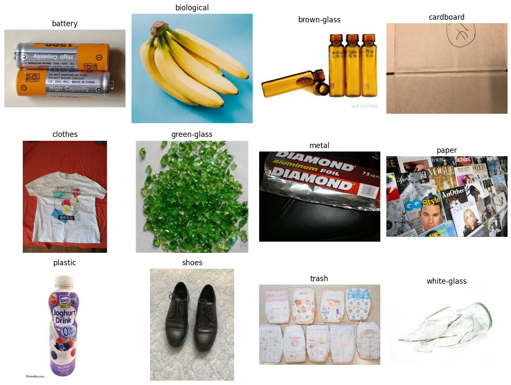

# Waste Classification – Computer Vision Pipeline

A lightweight end‑to‑end pipeline that classifies household waste into **12 categories**  
(`battery, biological, brown‑glass, cardboard, clothes, green‑glass, metal, paper, plastic, shoes, trash, white‑glass`)
using a fine‑tuned **MobileNetV2** CNN.

  

---

## Key Features
| Stage | Highlights |
|-------|------------|
| **Data Prep** | *Duplicate removal* via perceptual hashing → *Quality filtering* (blurriness, brightness, edge‑density) → *Balanced splitting* (train/val/test) with real‑time augmentation + class weighting |
| **Model** | Transfer‑learned MobileNetV2 (ImageNet weights). 20 epochs frozen‑base training + 10 epochs fine‑tune (last 20 layers) with ReduceLROnPlateau & EarlyStopping |
| **Accuracy** | **95 %** on 5.8 k unseen images with no class bias (macro F1 ≈ 0.93) |
| **Dataset** | [Garbage‑Classification – Kaggle](https://www.kaggle.com/datasets/mostafaabla/garbage-classification) |

---

## Quick Start

# clone repo
git clone https://github.com/muhameddgoda/waste-classification.git
cd waste-classification

# create env
python -m venv venv && source venv/bin/activate  # Windows: venv\Scripts\activate
pip install -r requirements.txt

# place raw dataset in ./garbage_classification/
# then run the notebook step‑by‑step:
jupyter notebook Project.ipynb

---

Outputs:
* `deduplicated_dataset/` — after Phase 1  
* `final_filtered_dataset/` / `final_unseen_dataset/` — after Phase 2  
* `split_dataset/` — ready for training  
* `final_mobilenet_model.h5` — saved trained model  

---

## Folder Structure
├── garbage_classification/        # raw images (12 class sub‑folders)
├── deduplicated_dataset/
├── final_filtered_dataset/
├── final_unseen_dataset/
├── split_dataset/
├── Project.ipynb                  # full pipeline notebook
├── requirements.txt
└── README.md

---

## Citation / Acknowledgement
Dataset courtesy of **Mostafa Abla** (Kaggle).  
Model and code by **Mohamed Goda** – 2025.

Feel free to fork and adapt!
